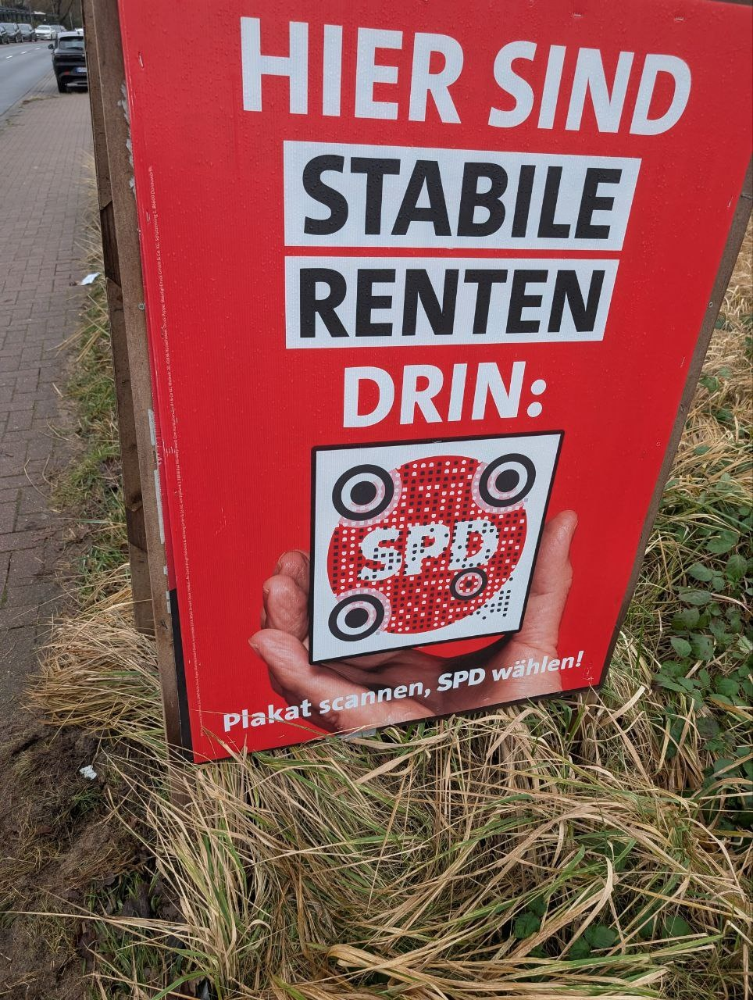

# QR-forgery

You can't change your QR in 3 bits \



# **Disclaimer: it's not about the politics at all. I just saw a QR on the street and had an idea "how many bits do I need to modify it to something that I control?"**

This material is published strictly for educational purposes only. The author(s) and publisher(s) do not condone or support the use of this material for illegal activities. The tools, techniques, and methods described herein should only be used on systems that you own, or have explicit permission to test. Unauthorized access to systems, networks, or data is a violation of applicable laws and regulations. Use this material responsibly and in compliance with all legal and ethical guidelines.

# wut ???

Calm down, these images are both fake 

This one is the original: \


# how?

let's find the most close QR using `pypy3 generate_similar_qr.py`

## Original:

https://qr.spd.de/tp/1
```
██████████████  ██      ██  ██  ██  ██████████████
██          ██  ██  ██████      ██  ██          ██
██  ██████  ██  ████████████████    ██  ██████  ██
██  ██████  ██    ██      ██    ██  ██  ██████  ██
██  ██████  ██  ██████  ██      ██  ██  ██████  ██
██          ██    ████████  ██  ██  ██          ██
██████████████  ██  ██  ██  ██  ██  ██████████████
                  ██████  ████  ██
██    ████████████    ██    ████████    ██  ██████
██    ██  ██  ██████    ██    ██  ██  ██████████
████        ████████  ██    ████  ██████████    ██
██    ██  ██        ██████    ██  ██      ████████
██  ████  ████  ████████    ██  ██████          ██
██    ██████    ██      ██  ████        ██    ██
████  ██  ████  ██  ██      ████████    ██████████
██    ██████        ██  ██            ██  ████  ██
██  ██  ██  ██  ██    ████████████████████  ████
                ██  ████    ██  ██      ██  ████
██████████████  ██  ██  ██████  ██  ██  ██      ██
██          ██  ██    ██  ██  ████      ██
██  ██████  ██  ████  ██  ██  ████████████    ████
██  ██████  ██  ██  ██  ██████  ██████        ████
██  ██████  ██    ██  ██  ██  ██        ██████████
██          ██      ████████  ██  ████████  ██████
██████████████  ██    ██████    ██        ██    ██
```

## Fake:

https://qr-spd.de/txi$
```
██████████████  ██████  ██  ██  ██  ██████████████
██          ██  ██  ██████      ██  ██          ██
██  ██████  ██  ████  ██████████    ██  ██████  ██
██  ██████  ██    ██      ██    ██  ██  ██████  ██
██  ██████  ██  ██████  ██      ██  ██  ██████  ██
██          ██    ████  ██  ██  ██  ██          ██
██████████████  ██  ██  ██  ██  ██  ██████████████
                    ████  ████  ██
██    ██████████████  ████  ████████    ██  ██████
██    ████      ██████  ████  ██  ██  ██████████
  ██        ██████          ████  ██████████    ██
      ██  ██    ██  ██  ██    ██  ██      ████████
████  ██  ████████  ██          ██████          ██
██    ██████  ████  ██  ██  ████        ██    ██
████  ██  ██████  ██      ██  ██████    ██████████
██    ██████      ██    ██        ██████  ████  ██
██  ██  ██  ██  ████  ████████████████████  ████
                ████████        ██      ██  ████
██████████████  ██  ██  ████    ██  ██  ██      ██
██          ██  ████████  ████████      ██
██  ██████  ██  ████  ██  ██  ████████████    ████
██  ██████  ██  ██████  ██████  ██████        ████
██  ██████  ██    ██  ██  ██  ██        ██████████
██          ██    ██████████  ██  ████████  ██████
██████████████  ████  ██████    ██        ██    ██
```

## Most close fake (MCF) to original 
https://qr-spd.de/txi$

Now let's use fake QR, set some borders and find the modifications \
so that our Most Close Fake (MCF) will still resolve to a fake link

`pypy3 generate_most_close_fake_qr.py 4`

I've managed to find the closest with border of 4 bits (but 5 is also possible, just need to wait)

[8] Difference: 28 (border 4)

Modifications:
```
[(0, 9, False), (0, 10, False), (2, 10, True), (10, 0, True), (11, 0, True), (12, 1, False), (12, 2, True), (21, 9, False), (23, 9, False), (24, 9, False), (5, 11, True), (7, 9, True), (8, 9, False), (8, 12, False), (9, 10, False), (10, 11, True), (11, 11, True), (12, 11, True)]
```
QR:
```
██████████████  ██      ██  ██  ██  ██████████████
██          ██  ██  ██████      ██  ██          ██
██  ██████  ██  ████████████████    ██  ██████  ██
██  ██████  ██    ██      ██    ██  ██  ██████  ██
██  ██████  ██  ██████  ██      ██  ██  ██████  ██
██          ██    ████████  ██  ██  ██          ██
██████████████  ██  ██  ██  ██  ██  ██████████████
                  ██████  ████  ██
██    ████████████    ██    ████████    ██  ██████
██    ████      ████    ████  ██  ██  ██████████
████        ██████    ██    ████  ██████████    ██
██    ██  ██    ██  ██████    ██  ██      ████████
██  ████  ████████  ████        ██████          ██
██    ██████  ████  ██  ██  ████        ██    ██
████  ██  ██████  ██      ██  ██████    ██████████
██    ██████      ██    ██        ██████  ████  ██
██  ██  ██  ██  ████  ████████████████████  ████
                ████████        ██      ██  ████
██████████████  ██  ██  ████    ██  ██  ██      ██
██          ██  ████████  ████████      ██
██  ██████  ██  ████  ██  ██  ████████████    ████
██  ██████  ██  ██  ██  ██████  ██████        ████
██  ██████  ██    ██  ██  ██  ██        ██████████
██          ██      ████████  ██  ████████  ██████
██████████████  ██    ██████    ██        ██    ██
```

## Most far original to MCF

Now, we need to find the most far origin (MFO) that is Most Close to MCF (using previously found modifications)

`pypy3 generate_most_far_original_qr.py`

https://qr.spd.de/tp/1
[3] Difference: 25 (border 4)

((9, 4, False), (9, 13, False), (12, 14, True))
```
██████████████  ██      ██  ██  ██  ██████████████
██          ██  ██  ██████      ██  ██          ██
██  ██████  ██  ████████████████    ██  ██████  ██
██  ██████  ██    ██      ██    ██  ██  ██████  ██
██  ██████  ██  ██████  ██      ██  ██  ██████  ██
██          ██    ████████  ██  ██  ██          ██
██████████████  ██  ██  ██  ██  ██  ██████████████
                  ██████  ████  ██
██    ████████████    ██    ████████    ██  ██████
██    ██        ████    ██    ██  ██  ██████████
████        ██████    ██    ████  ██████████    ██
██    ██  ██    ██  ██████    ██  ██      ████████
██  ████  ████████  ████    ██  ██████          ██
██    ██████  ████  ██  ██  ████        ██    ██
████  ██  ██████  ██      ██  ██████    ██████████
██    ██████      ██    ██        ██████  ████  ██
██  ██  ██  ██  ████  ████████████████████  ████
                ████████        ██      ██  ████
██████████████  ██  ██  ████    ██  ██  ██      ██
██          ██  ████████  ████████      ██
██  ██████  ██  ████  ██  ██  ████████████    ████
██  ██████  ██  ██  ██  ██████  ██████        ████
██  ██████  ██    ██  ██  ██  ██        ██████████
██          ██      ████████  ██  ████████  ██████
██████████████  ██    ██████    ██        ██    ██
```

## Gesammeln

Thus we took the original QR code (https://qr.spd.de/tp/1)

Modified 25 bits (x, y, bit)
[(9, 5, 0), (9, 7, 0), (10, 9, 0), (11, 8, 1), (12, 7, 1), (12, 9, 0), (13, 7, 1), (13, 10, 1), (14, 7, 1), (14, 8, 0), (14, 9, 1), (14, 10, 0), (14, 13, 1), (14, 14, 0), (15, 9, 1), (15, 10, 0), (15, 17, 1), (15, 18, 1), (16, 9, 1), (17, 9, 1), (17, 14, 0), (18, 14, 0), (19, 9, 1), (19, 10, 1), (19, 14, 1)])

And still got an original link (https://qr.spd.de/tp/1)

Modifying 3 more bits
[(9, 4, 1), (9, 13, 1), (12, 14, 0)]

Now it's fake (https://qr-spd.de/txi$)


## about iPhones:

I have pixel 8 and it shows the whole link

But iPhones show the domain only. Think about it


